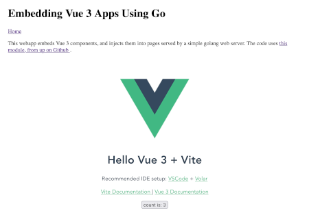

# Test Program for the Vite-Go Module



Here's a program to demonstrate the module. To run it, first add your Vue files. To automatically install the Vue "starter project" on Mac or Linux, you can run the command. The command will put Vue's various pieces in the right places for the test program.

```shell
$ ./install-vue.sh
```

Once you have your Vue files installed, just run the make script to build your Vue project, compile the test program and run it in development mode:

```shell
$ make dev
```

In development mode, the makefill will:

1. Start the vite dev server.
2. Run the go app using `go run`.
3. Serve the app at [http://localhost:4000](http://localhost:4000).

Development mode uses Vite's hot updating, and is very fast.

To demonstrate building the go app with the built Vue app embedded, run

```shell
$ make preview
```

The makefile will do the following:

1. Build a `dist/` directory from the starter app.
2. Build the go app binary (as `test_program`) from the `main.go` file.
2. Run the Go web server binary in `main.go` and post a sample page at [http://localhost:4000](http://localhost:4000).

The files demonstrate the basics of using vite-go in your go program:

* How to initialize the module and load your Vue files.
* How to set up the standard router in Go to find and serve your Vue-related files.

The test program takes a number of flags, which you need to use for the "production" build:

```shell
Usage of ./test_program:
  -assets string
    	location of javascript files. dist for production. (default "frontend")
  -entryp string
    	relative path of the entry point of the js app. (default "src/main.js")
  -env string
    	development|production (default "development")
  -platform string
    	vue|react|svelte (default "vue")
```

You'll need to have the make utility and npm installed for the demo 
